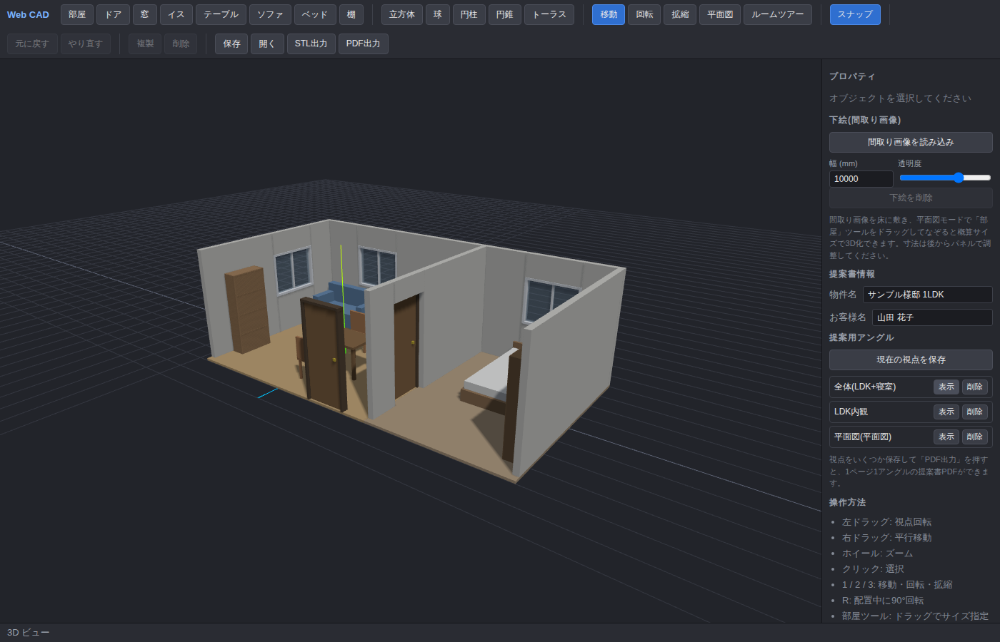
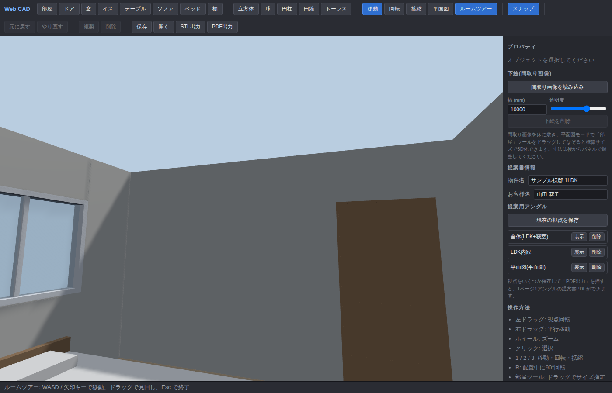

# claude-practice

Claude Codeの練習用リポジトリです。

## Web CAD

ブラウザで動く自作の 3D CAD ソフトです(TypeScript + Three.js + Vite)。



### 起動方法

```bash
npm install
npm run dev      # 開発サーバー(http://localhost:5173)
npm run build    # 本番ビルド(dist/ に出力)
```

### 機能

- **部屋の作成**: ワンクリック配置に加え、**ドラッグで好きな大きさに描けます**。カメラ側の壁は自動で非表示になるので、部屋の中が常に見えます。幅・奥行・壁高さはプロパティパネルで数値指定(**mm 単位**)
- **複数部屋の連結**: 部屋同士を近づけると辺がぴったり吸着。境界の壁にドアを置くと**両側の壁に開口部が開いて部屋がつながります**
- **間取り画像のトレース(下絵)**: 手元の平面図画像を床に敷いて、平面図モードで部屋ツールをなぞるだけで概算サイズの 3D 間取りに。寸法は後から mm で調整
- **ドア・窓**: 壁に近づけると自動で吸着し、壁に本物の開口部が開きます
- **ルームツアー**: 一人称視点で室内を歩けます(WASD / 矢印キーで移動、ドラッグで見回し)。壁はすり抜けず、**ドアの開口部を通って隣の部屋へ**移動できます
- **家具の配置**: イス・テーブル・ソファ・ベッド・棚。配置中に `R` キーで 90° 回転。壁際に置くと自動で吸着し、家具同士が重なると赤く警告表示
- **平面図モード**: 真上からの正射投影ビュー。部屋の幅・奥行の**寸法線(mm 表記)**が表示され、間取り図として使えます
- **提案書 PDF 出力**: 物件名・お客様名を入れた**表紙ページ**+1ページ1アングルの A4 横 PDF を出力(お客様への提案用)。平面図アングルには寸法線もそのまま入ります
- **基本図形の配置**: 立方体・球・円柱・円錐・トーラス。ツールバーで図形を選び、半透明のプレビューを見ながらクリックで配置
- **スナップ**: グリッドスナップ(0.5 単位)、回転スナップ(15°)、スケールスナップ(0.1)。ツールバーでオン/オフ切替
- **選択・編集**: クリックで選択し、ギズモで移動・回転・拡大縮小。プロパティパネルから数値・名前・色も編集可能
- **複製・削除**: Ctrl+D で複製、Delete で削除
- **Undo/Redo**: すべての操作を取り消し・やり直し可能(Ctrl+Z / Ctrl+Y)
- **保存/読込**: 独自 JSON 形式で保存・読込
- **STLエクスポート**: 3D プリントなどに使える STL(バイナリ)出力

### 操作方法

| 操作 | 内容 |
| --- | --- |
| 左ドラッグ | 視点回転 |
| 右ドラッグ | 平行移動(パン) |
| ホイール | ズーム |
| クリック | オブジェクト選択 |
| `1` / `2` / `3` | 移動 / 回転 / 拡縮モード |
| `Ctrl+Z` / `Ctrl+Y` | Undo / Redo |
| `Ctrl+D` | 複製 |
| `Delete` | 削除 |
| `R` | 配置中のプレビューを90°回転 |
| 部屋ツールでドラッグ | サイズを指定して部屋を描く |
| ルームツアー中 `WASD`/矢印 | 一人称移動(ドラッグで見回し) |
| `Esc` | 配置キャンセル / 選択解除 / ツアー終了 |

### サンプル

`examples/sample-room.json` に LDK+寝室の2部屋を連結した間取りサンプル(接続ドア・窓・家具・提案用アングル付き)があります。「開く」ボタンから読み込み、そのまま「PDF出力」や「ルームツアー」を試せます。



### 構成

```
index.html        # UI レイアウト(ツールバー・プロパティパネル)
src/main.ts       # アプリ本体(シーン・ツール・選択・入出力)
src/objects.ts    # 図形・部屋・家具の生成とシリアライズ
src/history.ts    # Undo/Redo コマンドスタック
src/style.css     # スタイル
examples/         # サンプルシーン(JSON)
```

## 目的

- Claude Codeの使い方を学ぶ
- GitとGitHubの基本的なワークフローを練習する
- PRの作成・レビューを体験する
